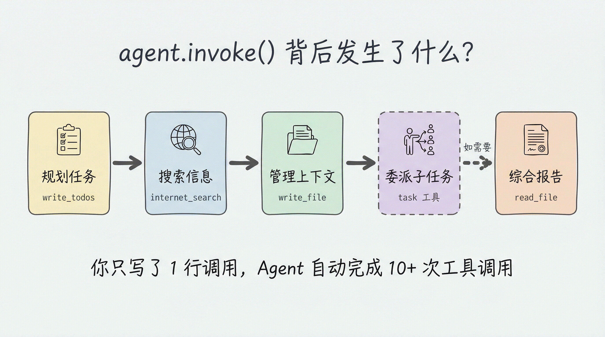
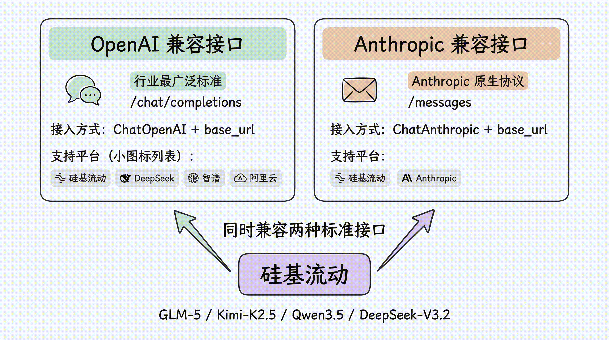

# 第 2 章：快速上手 — 5 分钟构建你的第一个 Deep Agent

> 上一章我们理解了 Deep Agents 的设计定位。本章进入实操环节——从安装到运行，带你完成第一个能搜索网络、撰写报告的研究助手。

## 环境准备

### 安装 Deep Agents

Deep Agents 以独立的 Python 包发布。本章示例通过 `ChatOpenAI` 接入模型，因此同时安装 `langchain-openai`。选择你习惯的包管理工具安装：

```bash
# pip
pip install deepagents langchain-openai

# uv（推荐，速度更快）
uv pip install deepagents langchain-openai

# poetry
poetry add deepagents langchain-openai
```

Python 版本要求 3.11+。

### 配置 API Key

Deep Agents 支持多种模型提供商。你需要至少配置一个模型的 API Key。

本系列推荐使用 [硅基流动（SiliconFlow）](https://siliconflow.cn/) 作为模型提供商。原因很简单：

- **国内直连**，无需代理
- **兼容 OpenAI 接口**，接入成本为零
- **提供免费模型**（10B 以下模型永久免费），非常适合学习和实验
- **模型选择丰富**：Qwen、DeepSeek、GLM 等主流开源模型均可使用

注册 [SiliconFlow 平台](https://cloud.siliconflow.cn/)，在 [API 密钥页面](https://cloud.siliconflow.cn/account/ak) 创建 Key，然后配置环境变量：

```bash
export SILICONFLOW_API_KEY="your-siliconflow-key"
# 可选：通过环境变量指定模型，方便整体切换，不必逐处修改代码
export MODEL_NAME="Qwen/Qwen2.5-7B-Instruct"   # 免费、支持 Tools，适合学习
```

> 当然，你也可以使用其他提供商（Anthropic、OpenAI、Google 等），只需配置对应的 API Key 即可。本系列的所有示例代码都以硅基流动为默认配置，但原理完全相同。

> **模型版本维护说明**：本系列示例默认使用免费的 `Qwen/Qwen2.5-7B-Instruct`（轻量、支持工具调用，适合入门学习与简单任务）。**注意：任务规划、上下文总结、多子 Agent 编排等复杂场景，以及叠加了中间件的进阶示例，小模型（如 7B）往往无法稳定跑通完整流程，请使用 SOTA 模型 `Pro/zai-org/GLM-5.1`**——后续 ch04 / ch05 等章节会按场景标注推荐模型。平台模型会不定期上下线，**建议用上面的 `MODEL_NAME` 环境变量管理模型名，而非写死在代码里**——这样模型变更时只需改一处环境变量。最新可用模型见 [模型广场](https://cloud.siliconflow.cn/models)。

## Hello World：最简单的 Deep Agent

让我们从最简单的例子开始——一个能回答天气问题的 Agent：

```python
import os
from langchain_openai import ChatOpenAI
from deepagents import create_deep_agent

# 通过硅基流动接入模型（兼容 OpenAI 接口）
model = ChatOpenAI(
    # 默认免费模型，可用 MODEL_NAME 环境变量覆盖（如付费的 Pro/zai-org/GLM-5.1）
    model=os.environ.get("MODEL_NAME", "Qwen/Qwen2.5-7B-Instruct"),
    api_key=os.environ["SILICONFLOW_API_KEY"],
    base_url="https://api.siliconflow.cn/v1",
)

def get_weather(city: str) -> str:
    """Get weather for a given city."""
    return f"It's always sunny in {city}!"

agent = create_deep_agent(
    model=model,
    tools=[get_weather],
    system_prompt="You are a helpful assistant.",
)

result = agent.invoke(
    {"messages": [{"role": "user", "content": "北京今天天气怎么样？"}]}
)

print(result["messages"][-1].content)
```

短短几行代码，一个具备工具调用能力的 Agent 就跑起来了。让我们拆解一下关键部分。

### `create_deep_agent()` 的核心参数

```python
agent = create_deep_agent(
    model=model,                           # 模型实例或字符串
    tools=[get_weather],                   # 自定义工具列表
    system_prompt="You are a helpful...",  # 系统提示词
)
```

| 参数 | 说明 | 默认值 |
|---|---|---|
| `model` | 模型实例（如 `ChatOpenAI`）或 `provider:model_name` 字符串 | `claude-sonnet-4-6`（可覆盖） |
| `tools` | 自定义工具函数列表 | `[]` |
| `system_prompt` | 系统提示词，定义 Agent 的角色和行为 | 内置默认提示词 |

注意，除了你传入的 `tools`，Deep Agent 还会自动附带一整套内置工具（文件系统、任务规划、子 Agent），这正是 Harness 的价值——你不需要手动配置这些。

### `agent.invoke()` 的输入输出

输入是一个包含 `messages` 的字典，遵循标准的消息格式：

```python
{"messages": [{"role": "user", "content": "你的问题"}]}
```

输出也是一个字典，`result["messages"]` 包含了完整的对话历史，最后一条消息就是 Agent 的最终回复：

```python
result["messages"][-1].content  # Agent 的回复文本
```

## 编写自定义工具

Deep Agents 的工具定义非常简单——**一个普通的 Python 函数就是一个工具**。Agent 通过函数的签名（参数名和类型标注）和 docstring 来理解这个工具能做什么。

### 工具定义的三要素

```python
def internet_search(
    query: str,                          # 1. 参数名 + 类型标注
    max_results: int = 5,
    topic: Literal["general", "news", "finance"] = "general",
) -> dict:                               # 2. 返回类型
    """Run a web search for the given query."""  # 3. Docstring
    # 实际的工具逻辑
    return tavily_client.search(query, max_results=max_results, topic=topic)
```

三要素缺一不可：

| 要素 | 作用 | 对 Agent 的影响 |
|---|---|---|
| **参数类型标注** | 告诉 Agent 每个参数该传什么类型 | 没有类型标注，Agent 可能传入错误类型 |
| **Docstring** | 告诉 Agent 这个工具的用途 | 没有 docstring，Agent 不知道何时该使用这个工具 |
| **默认值** | 标记哪些参数是可选的 | Agent 只需要填必需参数，减少出错概率 |

> 你可以把 docstring 想象成给 Agent 看的"使用说明书"——写得越清晰，Agent 用得越准确。

## 实战：构建一个研究助手

现在我们来构建一个真实可用的 Agent——一个能搜索互联网并撰写研究报告的助手。

### Step 1：安装依赖

我们使用 [Tavily](https://tavily.com/) 作为搜索 API（有免费额度），使用硅基流动作为模型提供商：

```bash
pip install deepagents langchain-openai tavily-python
```

配置 API Key：

```bash
export SILICONFLOW_API_KEY="your-siliconflow-key"
export TAVILY_API_KEY="your-tavily-key"
```

### Step 2：定义搜索工具

```python
import os
from typing import Literal
from tavily import TavilyClient

tavily_client = TavilyClient(api_key=os.environ["TAVILY_API_KEY"])

def internet_search(
    query: str,
    max_results: int = 5,
    topic: Literal["general", "news", "finance"] = "general",
    include_raw_content: bool = False,
):
    """Run a web search for the given query.

    Args:
        query: The search query string.
        max_results: Maximum number of results to return.
        topic: The topic category for the search.
        include_raw_content: Whether to include raw page content.
    """
    return tavily_client.search(
        query,
        max_results=max_results,
        include_raw_content=include_raw_content,
        topic=topic,
    )
```

### Step 3：创建 Agent 并配置系统提示词

系统提示词（System Prompt）是 Agent 的"人设"——它定义了 Agent 的角色、能力和工作方式：

```python
from langchain_openai import ChatOpenAI
from deepagents import create_deep_agent

# 使用硅基流动接入模型（默认免费的 Qwen2.5-7B 即可跑通，实际项目推荐 GLM-5.1）
model = ChatOpenAI(
    model=os.environ.get("MODEL_NAME", "Qwen/Qwen2.5-7B-Instruct"),  # 可用 MODEL_NAME 覆盖
    api_key=os.environ["SILICONFLOW_API_KEY"],
    base_url="https://api.siliconflow.cn/v1",
)

research_instructions = """你是一位专业的研究员。
你的工作是进行深入研究，然后撰写一份完整的研究报告。

你可以使用 internet_search 工具搜索互联网获取信息。
"""

agent = create_deep_agent(
    model=model,
    tools=[internet_search],
    system_prompt=research_instructions,
)
```

注意系统提示词中包含了工具使用说明——这不是必须的（Agent 能从 docstring 理解工具），但显式说明可以让 Agent 的行为更可预测。

### Step 4：运行 Agent

```python
result = agent.invoke(
    {"messages": [{"role": "user", "content": "什么是 LangGraph？"}]}
)

print(result["messages"][-1].content)
```

## Agent 在背后做了什么？

当你调用 `agent.invoke()` 时，Deep Agent 会自动执行一系列操作。这正是它作为 Harness 的价值所在——你只写了几行代码，但 Agent 背后的工作流程远比你看到的复杂：

1. **规划任务** — 调用内置的 `write_todos` 工具，把"研究 LangGraph"拆解为多个子步骤
2. **搜索信息** — 调用你提供的 `internet_search` 工具，执行多次网络搜索
3. **管理上下文** — 调用内置的 `write_file` 将大量搜索结果写入虚拟文件系统，避免上下文溢出
4. **委派子任务**（如需要）— 调用内置的 `task` 工具，将复杂子任务委派给专门的子 Agent
5. **综合报告** — 从文件系统中读取整理好的信息，撰写最终报告

这个过程中，Agent 可能调用了 10+ 次工具，但你只需要一次 `invoke()` 调用。



## 模型选择

Deep Agents 支持任何实现了工具调用（Tool Calling）的 LangChain Chat Model。

### 先理解两种标准接口

目前大模型行业已经形成了两种事实标准的 API 接口协议：

- **OpenAI 兼容接口**（`/chat/completions`）：最广泛采用的标准，国内外绝大多数平台都兼容
- **Anthropic 兼容接口**（`/messages`）：Anthropic 的原生协议，部分平台也提供兼容

硅基流动同时支持这两种接口，这意味着你可以用 `ChatOpenAI` 或 `ChatAnthropic` 来接入同一个平台上的模型。



### 方式一：OpenAI 兼容接口（推荐）

绝大多数国内模型平台（硅基流动、DeepSeek、智谱 AI、阿里云百炼等）都兼容 OpenAI 接口。通过 `ChatOpenAI` 设置 `base_url` 即可接入：

```python
from langchain_openai import ChatOpenAI

# 硅基流动（免费模型，适合学习）
model = ChatOpenAI(
    model="Qwen/Qwen2.5-7B-Instruct",
    api_key=os.environ["SILICONFLOW_API_KEY"],
    base_url="https://api.siliconflow.cn/v1",
)
agent = create_deep_agent(model=model)

# 硅基流动（推荐模型，效果更好）
model = ChatOpenAI(
    model="Pro/zai-org/GLM-5.1",
    api_key=os.environ["SILICONFLOW_API_KEY"],
    base_url="https://api.siliconflow.cn/v1",
)
agent = create_deep_agent(model=model)
```

> 这种 `base_url` 模式是接入国内平台的通用方法——换个 URL 和 Key 就能切换到 DeepSeek、智谱、阿里云等其他平台。

### 方式二：Anthropic 兼容接口

如果你偏好 Anthropic 的消息格式，硅基流动也提供了兼容接口：

```python
from langchain_anthropic import ChatAnthropic

model = ChatAnthropic(
    model="Pro/zai-org/GLM-5.1",
    api_key=os.environ["SILICONFLOW_API_KEY"],
    base_url="https://api.siliconflow.cn",
)
agent = create_deep_agent(model=model)
```

### 方式三：字符串格式（适合原生平台直连）

如果你直接使用 Anthropic 或 OpenAI 的官方 API（非第三方平台），可以用更简洁的字符串格式：

```python
# 直连 Anthropic 官方 API（需配置 ANTHROPIC_API_KEY）
agent = create_deep_agent(model="anthropic:claude-sonnet-4-6")

# 直连 OpenAI 官方 API（需配置 OPENAI_API_KEY）
agent = create_deep_agent(model="openai:gpt-4.1")
```

### 推荐模型

**硅基流动平台模型（国内首选）：**

以下模型均支持工具调用（Tools），可直接用于 Deep Agents：

**免费模型（适合学习和实验）：**

| 模型 | 参数量 | 特点 |
|---|---|---|
| `Qwen/Qwen2.5-7B-Instruct` | 7B | 中文理解优秀，支持 Tools，轻量快速，**免费** |

**推荐模型（适合实际使用）：**

| 模型 | 参数量 | 特点 |
|---|---|---|
| `nex-agi/Nex-N2-Pro` | — | 🔥 **限免**：能动性思考模型，自适应推理深度，编码/搜索/工具任务开源 SOTA，可与 Claude Code、Cursor 等即插即用——**限免期间是复杂任务的首选** |
| `Pro/zai-org/GLM-5.1` | 744B (MoE, 40B 激活) | 智谱最新旗舰，Agent 任务同类最佳，支持推理模式 |
| `Pro/moonshotai/Kimi-K2.6` | 1T (MoE, 32B 激活) | Kimi 最新旗舰，原生多模态智能体模型，256K 上下文 |
| `Pro/deepseek-ai/DeepSeek-V4-Pro` | 671B (MoE) | 推理和 Agent 能力顶级 |
| `Qwen/Qwen3.6-27B` | 27B | Qwen 最新系列，支持思考模式和视觉理解 |
| `Qwen/Qwen3.5-122B-A10B` | 122B (MoE, 10B 激活) | 旗舰级 MoE，仅 10B 激活参数，性价比极高 |

> 本系列示例代码默认使用免费的 `Qwen/Qwen2.5-7B-Instruct` 以降低入门门槛，它足以跑通本章的简单示例。但任务规划、多 Agent 编排等复杂场景小模型往往无法稳定完成，需改用 SOTA 模型——其中 `nex-agi/Nex-N2-Pro` **当前限免**，是复杂任务的首选，也可用 GLM-5.1、Kimi-K2.6 或 Qwen3.6 系列。建议用 `MODEL_NAME` 环境变量管理模型名，避免写死在代码中；完整模型列表见 [模型广场](https://cloud.siliconflow.cn/models)。

## 调试与追踪：LangSmith

当 Agent 的行为不符合预期时，你需要看到它"内部在想什么"。LangSmith 是 LangChain 的可观测性平台，可以记录 Agent 的每一次模型调用、工具调用和状态变化。

### 快速配置

```bash
export LANGSMITH_TRACING=true
export LANGSMITH_API_KEY="your-langsmith-key"
```

设置好环境变量后，无需修改任何代码，你的 Agent 运行记录就会自动上传到 LangSmith。

### 你能看到什么

在 LangSmith 的 Trace 面板中，你可以看到：

- Agent 的完整决策链路（每次模型调用的输入/输出）
- 工具调用的参数和返回值
- 子 Agent 的执行过程
- 每一步的 token 消耗和耗时
- 虚拟文件系统中文件的变化

这对于理解"Agent 为什么做了这个决定"至关重要，尤其是在调试复杂的多步骤任务时。

## 完整代码

把上面的内容整合在一起，以下是完整的可运行代码：

```python
import os
from typing import Literal
from langchain_openai import ChatOpenAI
from tavily import TavilyClient
from deepagents import create_deep_agent

# 1. 配置模型（通过硅基流动接入，默认免费模型即可跑通）
model = ChatOpenAI(
    model=os.environ.get("MODEL_NAME", "Qwen/Qwen2.5-7B-Instruct"),  # 实际项目推荐 "Pro/zai-org/GLM-5.1"
    api_key=os.environ["SILICONFLOW_API_KEY"],
    base_url="https://api.siliconflow.cn/v1",
)

# 2. 初始化搜索客户端
tavily_client = TavilyClient(api_key=os.environ["TAVILY_API_KEY"])

# 3. 定义搜索工具
def internet_search(
    query: str,
    max_results: int = 5,
    topic: Literal["general", "news", "finance"] = "general",
    include_raw_content: bool = False,
):
    """Run a web search for the given query.

    Args:
        query: The search query string.
        max_results: Maximum number of results to return.
        topic: The topic category for the search.
        include_raw_content: Whether to include raw page content.
    """
    return tavily_client.search(
        query,
        max_results=max_results,
        include_raw_content=include_raw_content,
        topic=topic,
    )

# 4. 定义系统提示词
research_instructions = """你是一位专业的研究员。
你的工作是进行深入研究，然后撰写一份完整的研究报告。

你可以使用 internet_search 工具搜索互联网获取信息。
"""

# 5. 创建 Agent
agent = create_deep_agent(
    model=model,
    tools=[internet_search],
    system_prompt=research_instructions,
)

# 6. 运行
result = agent.invoke(
    {"messages": [{"role": "user", "content": "什么是 LangGraph？"}]}
)
print(result["messages"][-1].content)
```

## 小结

本章我们完成了从零到一的实践：

1. **环境搭建**：`pip install deepagents langchain-openai` + 配置硅基流动 API Key
2. **模型接入**：通过 `ChatOpenAI` + `base_url` 接入硅基流动，国内直连、免费模型可用
3. **核心 API**：`create_deep_agent(model, tools, system_prompt)` 创建 Agent，`agent.invoke()` 运行
4. **自定义工具**：Python 函数 + 类型标注 + docstring = 一个工具，Agent 自动理解
5. **自动化能力**：你只传入一个工具，Agent 自动获得文件系统、任务规划、子 Agent 等完整能力
6. **调试追踪**：设置 `LANGSMITH_TRACING=true` 即可看到 Agent 的完整决策链路

下一章，我们将深入 Deep Agents 最核心的创新——虚拟文件系统，理解它如何通过 Context Engineering 解决上下文管理的难题。
