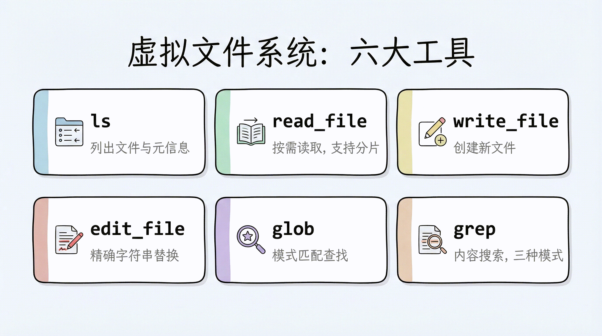
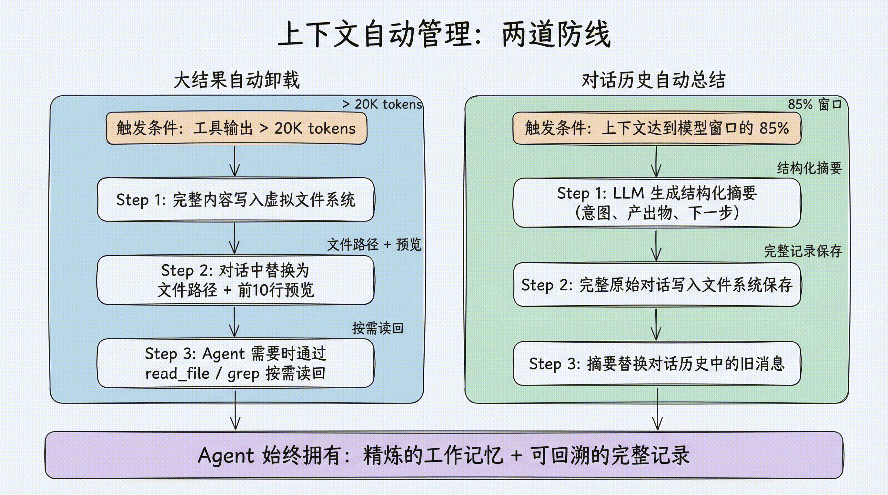
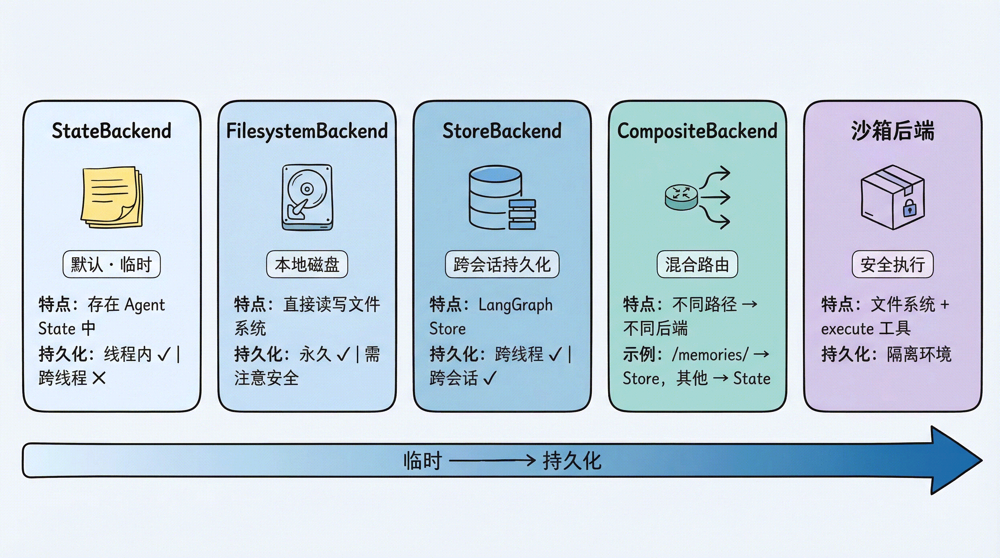

# 第 3 章：虚拟文件系统 — Deep Agents 的 Context Engineering 核心

> 上一章我们跑通了第一个 Deep Agent。本章深入 Deep Agents 最核心的创新——虚拟文件系统。理解它，就理解了 Deep Agents 区别于其他 Agent 框架的根本设计哲学。

## 为什么用"文件系统"管理上下文？

在第 1 章中我们提到，传统的 Agent 开发有一个致命问题：**所有信息都直接塞进 prompt**。文件内容、搜索结果、中间计算——全部挤在一个不断膨胀的对话历史里。

Deep Agents 的解决方案是：**给 Agent 一个文件系统**。

这个思路其实很符合直觉——想想你自己是怎么工作的：

- 你不会把所有资料同时打开铺在桌面上
- 你会把资料**分门别类存放**，需要时再取出来
- 你会用**搜索**快速定位需要的内容
- 你会在**便签纸**上记录中间结果

Deep Agents 让 Agent 也能这样工作。它提供了一整套文件操作工具，Agent 可以像人类一样按需读取、结构化存储、搜索定位。

## 六大文件系统工具

Deep Agents 的虚拟文件系统提供了 6 个核心工具：

| 工具 | 用途 | 类比 |
|---|---|---|
| `ls` | 列出目录中的文件和元信息（大小、修改时间） | 打开文件夹看看有什么 |
| `read_file` | 读取文件内容，支持偏移量和限制条数；原生支持多模态格式（图片、视频、音频、PDF/PPT） | 翻开某份资料阅读 |
| `write_file` | 创建新文件 | 写一份新的备忘录 |
| `edit_file` | 对已有文件做精确字符串替换 | 用红笔修改文档 |
| `glob` | 按模式匹配查找文件（如 `**/*.py`） | 在文件柜中按标签找 |
| `grep` | 搜索文件内容，支持正则、上下文、计数 | 全文检索 |



### `read_file`：不只是"读文件"

`read_file` 有两个值得特别关注的特性。

**特性一：分片读取**

对于大文件，`read_file` 支持按偏移量和行数读取，避免一次性把整个文件塞进上下文：

```python
# 读取整个文件（默认前 2000 行）
read_file("/workspace/report.md")

# 从第 100 行开始，读取 50 行
read_file("/workspace/report.md", offset=100, limit=50)
```

**特性二：原生多模态支持**

`read_file` 不只能读文本——它原生支持多种多媒体格式，直接返回多模态内容块，让 Agent 能"看到"图片、"听到"音频、"读懂"文档：

| 类型 | 支持格式 |
|---|---|
| 图片 | `.png` `.jpg` `.jpeg` `.gif` `.webp` `.heic` `.heif` |
| 视频 | `.mp4` `.mpeg` `.mov` `.avi` `.flv` `.mpg` `.webm` `.wmv` `.3gpp` |
| 音频 | `.wav` `.mp3` `.aiff` `.aac` `.ogg` `.flac` |
| 文档 | `.pdf` `.ppt` `.pptx` |

这意味着 Agent 可以直接处理截图、录音、演示文稿——不再局限于纯文本工作流。

### `grep`：三种输出模式

`grep` 是 Agent 快速定位信息的利器。它支持三种输出模式：

- **`files_with_matches`**：只返回匹配的文件路径（快速定位）
- **`content`**：返回匹配行及上下文（深入查看）
- **`count`**：返回匹配数量（概览统计）

```python
# 找到所有包含 "TODO" 的 Python 文件
grep("TODO", glob="**/*.py", output_mode="files_with_matches")

# 查看匹配内容及前后 3 行上下文
grep("def create_agent", output_mode="content", context=3)
```

## 上下文自动管理：不只是存文件

虚拟文件系统最大的价值不在于"存文件"本身，而在于它与 Deep Agents 的**上下文自动管理机制**紧密配合。

### 大结果自动卸载

当工具调用的输入或输出超过 20,000 tokens 时（可通过 `tool_token_limit_before_evict` 配置），Deep Agents 会自动：

1. 将完整内容**写入虚拟文件系统**
2. 在对话历史中**替换为文件路径引用** + 前 10 行预览
3. Agent 需要时可以**按需读回**

比如 Agent 调用搜索工具返回了大量结果：

```
原始结果：[50000 tokens 的搜索结果]

自动卸载后：
"结果已保存到 /workspace/search_results_001.md，
 前 10 行预览：
   1  # Search Results for 'LangGraph'
   2
   3  ## Result 1: Official Documentation
   4  ..."
```

这个机制是**完全自动的**——Agent 不需要手动管理，但可以随时通过 `read_file` 或 `grep` 重新访问完整内容。

### 对话历史总结

当上下文大小达到模型窗口的 85% 时，如果没有更多可卸载的内容，Deep Agents 会启动**自动总结**：

1. 用 LLM 生成对话的结构化摘要（意图、产出物、下一步）
2. 将完整的原始对话**写入文件系统**保存
3. 用摘要**替换**对话历史中的旧消息

这种"双保险"设计意味着：Agent 既有精炼的工作记忆（摘要），又能在需要时回溯细节（文件系统中的完整记录）。



## 可插拔的存储后端

到目前为止我们讨论的"虚拟文件系统"是一个抽象概念。具体的文件存到哪里，由<strong>后端（Backend）</strong>决定。

Deep Agents 的后端是**可插拔的**——你可以根据场景选择不同的存储策略。

### StateBackend（默认）：临时存储

```python
from deepagents import create_deep_agent

# 默认就是 StateBackend，不需要显式指定
agent = create_deep_agent(model=model)
```

文件存在 LangGraph 的 Agent State 中。特点：

- 同一个对话线程内**持久化**（多轮对话不丢失）
- 对话结束后**丢失**（换一个 thread 就没了）
- 主 Agent 和子 Agent **共享**文件

适合场景：大多数情况下的默认选择，Agent 的"草稿纸"。

### FilesystemBackend：本地磁盘

```python
from deepagents.backends import FilesystemBackend

agent = create_deep_agent(
    model=model,
    backend=FilesystemBackend(root_dir=".", virtual_mode=True)
)
```

文件直接读写**本地文件系统**。特点：

- `root_dir` 指定 Agent 可访问的根目录；相对路径会被解析为绝对路径（`Path(root_dir).resolve()`），`"."` 即当前工作目录
- `virtual_mode=True` 启用路径沙箱（阻止 `..`、`~` 及越界的绝对路径），**强烈建议开启**；若为默认的 `virtual_mode=False`，即使设了 `root_dir` 也不提供任何越界保护
- 文件修改是**永久的、不可逆的**

适合场景：本地开发 CLI（编程助手）、CI/CD 流水线。

> 💡 `virtual_mode` 从 0.5.0 起不显式声明会有弃用警告，0.6.0 起变为必填。建议直接写 `virtual_mode=True` 开启路径沙箱。

> ⚠️ 安全提示：Agent 可以读取 `root_dir` 下所有文件，包括 `.env`、密钥等敏感文件。Web 服务或 API 场景中切勿使用此后端，应改用沙箱后端。建议配合 Human-in-the-Loop 使用。

### LocalShellBackend：本地 Shell 执行

```python
from deepagents.backends import LocalShellBackend

agent = create_deep_agent(
    model=model,
    backend=LocalShellBackend(root_dir=".", virtual_mode=True, env={"PATH": "/usr/bin:/bin"})
)
```

`LocalShellBackend` 是 `FilesystemBackend` 的扩展，在文件系统工具之外**额外提供 `execute` 工具**，可直接在宿主机运行 Shell 命令。特点：

- 命令通过 `subprocess.run(shell=True)` 执行，**无任何沙箱隔离**
- 支持 `timeout`（默认 120 秒）、`max_output_bytes`（默认 100,000）、`env` 等参数
- `root_dir` 作为命令的工作目录，但命令可访问系统上任意路径

适合场景：本地开发环境的编程助手、你完全信任 Agent 行为的个人开发机。

> 💡 `virtual_mode` 从 0.5.0 起不显式声明会有弃用警告，0.6.0 起变为必填。建议直接写 `virtual_mode=True` 开启路径沙箱。

> ⚠️ 极高风险警告：Agent 可执行任意 Shell 命令，包括删除文件、外传数据、消耗资源。**绝对不要在生产环境或多用户系统中使用。** 沙箱后端是生产环境的安全替代方案。

如果确实要在个人开发机中临时使用，至少做几层防护：

- 将 `root_dir` 指向一个专门的临时工作区，而不是用户主目录或整个仓库上级目录
- 显式设置 `virtual_mode=True`，并用最小化的 `env` / `PATH` 降低命令可见范围
- 不把 `.env`、私钥、云凭证、生产配置文件放进 Agent 可访问目录
- 对 `rm`、`mv`、安装依赖、修改配置、访问网络等高风险操作增加 Human-in-the-Loop 审批
- 需要运行不可信代码、处理用户上传文件或对外提供服务时，直接换用沙箱后端，不要用 `LocalShellBackend`

### StoreBackend：跨会话持久化

```python
from langgraph.store.memory import InMemoryStore
from deepagents.backends import StoreBackend

agent = create_deep_agent(
    model=model,
    backend=StoreBackend(
        namespace=lambda rt: (rt.server_info.user.identity,),  # 按用户隔离数据
    ),
    store=InMemoryStore()  # 开发用；部署到 LangSmith 时可省略，平台自动提供
)
```

文件存在 LangGraph 的 Store 中。特点：

- **跨线程持久化**——不同对话都能访问同一份文件
- `namespace` 参数控制数据隔离：`lambda rt: (rt.server_info.user.identity,)` 按用户隔离，防止数据混用
- 开发用 `InMemoryStore`，部署到 LangSmith 时省略 `store` 参数（平台自动配置）

适合场景：长期记忆、跨会话的用户偏好、累积的知识库。

> 💡 `namespace` 从 v0.5.0 起是必填参数。`rt.server_info.user.identity` 部署到 LangSmith 时能自动拿到用户身份，但本地 `invoke()` 时 `rt.server_info` 是 `None`，直接访问会报错。本地调试可以先兜一下：
>
> ```python
> namespace=lambda rt: (
>     (rt.server_info.user.identity,)
>     if rt.server_info else
>     ("local-user",)
> ),
> ```

### CompositeBackend：混合路由

这是最灵活的方案——**不同路径走不同后端**：

```python
from deepagents import create_deep_agent
from deepagents.backends import CompositeBackend, StateBackend, StoreBackend
from langgraph.store.memory import InMemoryStore

agent = create_deep_agent(
    model=model,
    backend=CompositeBackend(
        default=StateBackend(),            # 默认：临时存储
        routes={
            "/memories/": StoreBackend(
                namespace=lambda rt: (rt.server_info.user.identity,),
            ),
        }
    ),
    store=InMemoryStore()
)
```

> 💡 `namespace` 本地需要加 `if rt.server_info else ("local-user",)` 兜底。

效果：

- Agent 写入 `/workspace/plan.md` → StateBackend（临时）
- Agent 写入 `/memories/preferences.txt` → StoreBackend（持久化，按用户隔离）
- `ls`、`glob`、`grep` 自动聚合所有后端的结果，路径前缀保留

这种设计让 Agent 既有快速的"草稿纸"（State），又有持久的"记忆库"（Store），通过路径前缀自然隔离。

### 沙箱后端：安全代码执行

当使用沙箱后端（Modal、Daytona、Runloop 等）时，除了文件系统工具外，Agent 还会获得一个额外的 `execute` 工具，可以在隔离环境中执行 Shell 命令：

```python
# 沙箱后端自动提供 execute 工具
agent = create_deep_agent(
    model=model,
    backend=sandbox  # 沙箱实例
)
# Agent 现在可以运行: execute("pip install pandas && python analyze.py")
```

我们会在后续的沙箱执行章节详细讲解。



### 后端选择指南

| 场景 | 推荐后端 | 理由 |
|---|---|---|
| 学习和实验 | StateBackend（默认） | 零配置，自动清理 |
| 本地编程助手 | FilesystemBackend | 直接操作项目文件 |
| 需要跨会话记忆 | CompositeBackend | 混合临时 + 持久化 |
| 需要执行代码 | 沙箱后端 | 安全隔离 |
| 生产部署 | StoreBackend 或 CompositeBackend | 持久化 + 可伸缩 |

## 自定义后端与安全策略

### 声明式权限：FilesystemPermission

最简单的路径访问控制方式是使用 `FilesystemPermission`，无需修改后端代码：

```python
from deepagents import create_deep_agent, FilesystemPermission

agent = create_deep_agent(
    model=model,
    backend=CompositeBackend(
        default=StateBackend(),
        routes={
            "/memories/": StoreBackend(
                namespace=lambda rt: (rt.server_info.user.identity,),
            ),
        },
    ),
    permissions=[
        FilesystemPermission(
            operations=["write"],
            paths=["/policies/**"],
            mode="deny",           # 禁止写入 /policies/ 下的任何文件
        ),
    ],
)
```

> 💡 `namespace` 本地需要加 `if rt.server_info else ("local-user",)` 兜底。

权限规则在工具调用前按声明顺序求值，采用 first-match-wins：第一个同时匹配 `operations` 和 `paths` 的规则决定结果；如果没有规则匹配，则默认允许。因此配置权限时，应将更具体的规则放在更宽泛的规则之前。

### 实现自定义后端

如果内置后端不满足需求（比如要接入 S3 或 Postgres），可以实现 `BackendProtocol` 接口：

```python
from deepagents.backends.protocol import (
    BackendProtocol, WriteResult, EditResult, LsResult, ReadResult, GrepResult, GlobResult,
)

class S3Backend(BackendProtocol):
    def __init__(self, bucket: str, prefix: str = ""):
        self.bucket = bucket
        self.prefix = prefix.rstrip("/")

    def ls(self, path: str) -> LsResult:
        # 列出 S3 对象，返回 FileInfo 列表
        ...

    def read(self, file_path: str, offset: int = 0, limit: int = 2000) -> ReadResult:
        # 读取 S3 对象，返回 ReadResult(file_data=...) 或 ReadResult(error=...)
        ...

    def write(self, file_path: str, content: str) -> WriteResult:
        # 写入 S3 对象，外部存储后端 files_update=None
        ...

    def edit(self, file_path: str, old_string: str, new_string: str,
             replace_all: bool = False) -> EditResult:
        # 读取 → 替换 → 写回
        ...

    def grep(self, pattern: str, path: str | None = None, glob: str | None = None) -> GrepResult:
        # 搜索匹配内容
        ...

    def glob(self, pattern: str, path: str = "/") -> GlobResult:
        # 模式匹配，返回 FileInfo 列表
        ...
```

`BackendProtocol` 要求实现 6 个方法：`ls`、`read`、`write`、`edit`、`grep`、`glob`。

### 安全策略：PolicyWrapper

对于需要拦截策略（速率限制、审计日志、内容检查）的场景，可以通过继承或包装后端实现：

**方式一：继承现有后端**

```python
from deepagents.backends.filesystem import FilesystemBackend
from deepagents.backends.protocol import WriteResult, EditResult

class GuardedBackend(FilesystemBackend):
    def __init__(self, *, deny_prefixes: list[str], **kwargs):
        super().__init__(**kwargs)
        self.deny_prefixes = [p if p.endswith("/") else p + "/" for p in deny_prefixes]

    def write(self, file_path: str, content: str) -> WriteResult:
        if any(file_path.startswith(p) for p in self.deny_prefixes):
            return WriteResult(error=f"写入被拒绝：{file_path}")
        return super().write(file_path, content)

    def edit(self, file_path: str, old_string: str, new_string: str,
             replace_all: bool = False) -> EditResult:
        if any(file_path.startswith(p) for p in self.deny_prefixes):
            return EditResult(error=f"编辑被拒绝：{file_path}")
        return super().edit(file_path, old_string, new_string, replace_all)
```

**方式二：通用包装器**（适用于任何后端）

```python
from deepagents.backends.protocol import BackendProtocol, WriteResult, EditResult

class PolicyWrapper(BackendProtocol):
    def __init__(self, inner: BackendProtocol, deny_prefixes: list[str]):
        self.inner = inner
        self.deny_prefixes = [p if p.endswith("/") else p + "/" for p in deny_prefixes]

    def _deny(self, path: str) -> bool:
        return any(path.startswith(p) for p in self.deny_prefixes)

    def ls(self, path): return self.inner.ls(path)
    def read(self, file_path, offset=0, limit=2000): return self.inner.read(file_path, offset=offset, limit=limit)
    def grep(self, pattern, path=None, glob=None): return self.inner.grep(pattern, path, glob)
    def glob(self, pattern, path="/"): return self.inner.glob(pattern, path)

    def write(self, file_path: str, content: str) -> WriteResult:
        if self._deny(file_path):
            return WriteResult(error=f"写入被拒绝：{file_path}")
        return self.inner.write(file_path, content)

    def edit(self, file_path: str, old_string: str, new_string: str,
             replace_all: bool = False) -> EditResult:
        if self._deny(file_path):
            return EditResult(error=f"编辑被拒绝：{file_path}")
        return self.inner.edit(file_path, old_string, new_string, replace_all)
```

## 小结

本章我们深入了 Deep Agents 的核心——虚拟文件系统：

1. **设计哲学**：让 Agent 像人一样工作——按需读取、结构化存储、搜索定位，而不是把所有信息塞进 prompt
2. **六大工具**：`ls`、`read_file`、`write_file`、`edit_file`、`glob`、`grep`，覆盖了文件操作的完整生命周期
3. **自动上下文管理**：大结果自动卸载（>20K tokens → 文件 + 引用）、对话历史自动总结（>85% 窗口 → 摘要 + 完整记录保存到文件）
4. **可插拔后端**：StateBackend（临时）、FilesystemBackend（本地磁盘）、LocalShellBackend（本地 Shell）、StoreBackend（持久化）、CompositeBackend（混合路由）、沙箱后端（安全执行）
5. **权限控制**：`FilesystemPermission` 声明式权限；`GuardedBackend` 或 `PolicyWrapper` 实现定制策略
6. **废弃提醒**：工厂函数模式（`lambda rt: StateBackend(rt)`）已废弃，直接传实例即可

下一章，我们将学习另一个核心能力——任务规划，看 `write_todos` 工具如何让 Agent 学会拆解复杂任务。
