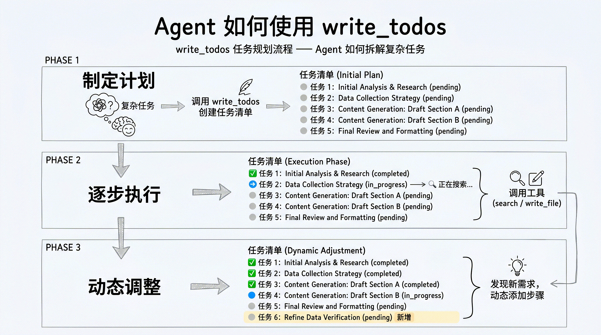

# 第 4 章：任务规划与分解 — 让 Agent 学会拆解复杂任务

> 上一章我们学习了虚拟文件系统如何管理 Agent 的上下文。本章聚焦另一个核心能力——任务规划。一个不会规划的 Agent，面对复杂任务时就像无头苍蝇；而 `write_todos` 工具，让 Agent 学会像人一样拆解任务、追踪进度。

## 为什么 Agent 需要"规划"能力？

### 简单任务 vs 复杂任务

对于简单任务，Agent 可以一步到位：

```
用户：北京今天天气怎么样？
Agent：[调用天气工具] → 今天北京晴，25°C。
```

但对于复杂任务，一步到位是不可能的：

```
用户：帮我调研 LangGraph 的技术架构，对比三个竞品，写一份 3000 字的分析报告。
```

这个任务涉及：搜索多个信息源、阅读和整理大量资料、对比分析、组织结构、撰写报告。没有规划，Agent 要么遗漏步骤，要么在某个环节陷入死循环。

### 没有规划的 Agent 会怎样？

- **遗漏关键步骤**：直接开始写报告，忘了先搜索竞品信息
- **重复劳动**：搜索了同一个关键词三次，因为它"忘记"已经搜过了
- **半途而废**：上下文太长后，Agent 失去了对整体进度的把控
- **质量不稳定**：有时做得很好，有时莫名跳过重要环节

规划能力让 Agent 能够**先思考再行动**——把大任务拆解为小步骤，然后逐步执行、追踪进度、动态调整。

## `write_todos` 工具详解

Deep Agents 内置了一个 `write_todos` 工具，让 Agent 可以创建和管理任务清单。这个工具在 `create_deep_agent()` 时自动注入，无需手动配置。

### 任务的数据结构

每个任务包含以下字段：

```python
{
    "subject": "搜索 LangGraph 官方文档",     # 任务标题
    "description": "查找核心架构、API 设计...",  # 详细描述
    "status": "pending"                        # 状态
}
```

### 三种状态

| 状态 | 含义 | 典型场景 |
|---|---|---|
| `pending` | 待办 | Agent 刚规划出来，还没开始做 |
| `in_progress` | 进行中 | Agent 正在执行这个步骤 |
| `completed` | 已完成 | Agent 确认做完了 |

状态流转：`pending` → `in_progress` → `completed`

### Agent 怎么用 write_todos？

当 Agent 收到一个复杂任务时，它的典型行为是：

**第一步：制定计划**

```
Agent 思考：这个任务比较复杂，我先拆解一下。
Agent 调用 write_todos：
  1. [pending] 搜索 LangGraph 官方文档和核心概念
  2. [pending] 搜索三个竞品（Temporal、Inngest、Prefect）
  3. [pending] 对比分析各产品的优劣势
  4. [pending] 撰写报告大纲
  5. [pending] 撰写完整报告
```

**第二步：逐步执行**

```
Agent 更新任务 1 状态为 in_progress
Agent 调用 internet_search("LangGraph architecture")
Agent 调用 write_file("/workspace/langgraph_notes.md", ...)
Agent 更新任务 1 状态为 completed

Agent 更新任务 2 状态为 in_progress
Agent 调用 internet_search("Temporal vs LangGraph")
...
```

**第三步：动态调整**

在执行过程中，Agent 可能发现需要额外的步骤：

```
Agent 思考：搜索时发现 Prefect 不太合适，应该换成 Durable Objects。
Agent 调用 write_todos 更新列表：
  1. [completed] 搜索 LangGraph 官方文档和核心概念
  2. [in_progress] 搜索三个竞品
  3. [pending] 对比分析各产品的优劣势
  4. [pending] 撰写报告大纲
  5. [pending] 撰写完整报告
  6. [pending] 补充 Durable Objects 的资料 ← 新增
```



### 任务清单的持久化

任务清单**持久化在 Agent State 中**，这意味着：

- 在同一个对话中，任务清单不会丢失
- 即使 Agent 的对话历史被总结压缩，任务清单依然完整
- 子 Agent 无法访问主 Agent 的任务清单（上下文隔离）

## 揭开引擎盖：LangChain 中间件

到目前为止，我们一直从 Deep Agents 的视角看 `write_todos`——"调用 `create_deep_agent()` 就自动有了"。但如果你想真正理解这个能力是**怎么实现的**，以及将来**如何自己扩展**，就需要揭开引擎盖，看看底层的 LangChain 中间件机制。

还记得第 1 章的三层架构吗？Deep Agents（Harness）构建在 LangChain（Framework）之上。而 LangChain 提供了一套<strong>中间件（Middleware）</strong>系统——它是 Agent 能力的插件机制。`create_deep_agent()` 内部做的事情，本质上就是把一组中间件**自动组装**到了 Agent 上。

`create_deep_agent()` 的中间件堆栈分为三层：

**常驻层（始终启用，无论传入什么参数）**：
- `TodoListMiddleware` — 任务规划，注入 `write_todos` 工具和规划提示词
- `FilesystemMiddleware` — 注入 6 个文件工具，并执行 `permissions` 权限规则
- `SummarizationMiddleware` — 上下文自动压缩，触发阈值可配置
- `PatchToolCallsMiddleware` — 内部工具调用修补（框架内部使用）
- `AnthropicPromptCachingMiddleware` — 提示词缓存加速（非 Anthropic 模型自动跳过）

**条件层（按参数自动激活）**：
- `SubAgentMiddleware` — 有子 Agent 时启用，自动加入通用子 Agent；注入 `task` 工具
- `SkillsMiddleware` — 传入 `skills=` 参数时启用，注入技能包
- `AsyncSubAgentMiddleware` — 传入异步子 Agent 时启用
- `MemoryMiddleware` — 传入 `memory=` 参数时启用，注入 AGENTS.md 记忆
- `HumanInTheLoopMiddleware` — 传入 `interrupt_on=` 参数时启用，拦截指定工具调用等待人工审批

**用户自定义层**（通过 `middleware=[...]` 参数插入，位于条件层之后）：
- 可按需叠加 LangChain 提供的任何中间件

理解这三层，你就能：
- 看懂 Deep Agents 内部是怎么拼装出来的
- 自己按需添加新能力（PII 脱敏、模型降级、调用次数限制……）
- 在更底层的 LangChain `create_agent()` 上搭建定制化的 Agent


### TodoListMiddleware：write_todos 的真身

`write_todos` 工具在 Deep Agents 中是自动内置的。它的底层实现就是 LangChain 的 `TodoListMiddleware`。如果你使用更底层的 `create_agent()`，可以手动添加这个能力：

```python
import os
from langchain_openai import ChatOpenAI
from langchain.agents import create_agent
from langchain.agents.middleware import TodoListMiddleware, FilesystemMiddleware

model = ChatOpenAI(
    # 任务规划属于复杂推理场景，需要 SOTA 模型；小模型（如 7B）往往无法稳定完成多步骤规划任务
    model="Pro/zai-org/GLM-5.1",
    api_key=os.environ["SILICONFLOW_API_KEY"],
    base_url="https://api.siliconflow.cn/v1",
)

agent = create_agent(
    model=model,
    tools=[run_tests],
    middleware=[
        TodoListMiddleware(),
        FilesystemMiddleware(),   # 自动注入 read_file / write_file 等文件工具
    ],
)
```

添加 `TodoListMiddleware` 后，Agent 会自动获得：

1. **`write_todos` 工具** — 创建和管理任务清单
2. **规划指导提示词** — 自动注入到系统提示词中，引导 Agent 在面对复杂任务时先规划再执行

这段代码展示了 LangChain `create_agent()` 的用法——注意和 Deep Agents 的 `create_deep_agent()` 的区别：前者需要你**手动选择和组合**中间件，后者帮你**预设好了一套最佳组合**。

### 自定义配置

`TodoListMiddleware` 支持两个可选参数：

```python
TodoListMiddleware(
    system_prompt="...",      # 自定义规划指导提示词
    tool_description="...",   # 自定义 write_todos 工具的描述
)
```

大多数情况下，默认配置就够了。只有当你发现 Agent 的规划行为需要特别引导时（比如"总是先写测试再写代码"），才需要自定义 `system_prompt`。

### SummarizationMiddleware：上下文压缩的真身

第 3 章讲的"对话历史自动总结"，底层就是 `SummarizationMiddleware`。它和 `TodoListMiddleware` 一样，也是 LangChain 的预构建中间件之一。

## 任务规划与上下文管理的协同

在长时间运行的任务中，任务规划和上下文管理需要**协同工作**。

### 问题场景

假设 Agent 正在执行一个包含 10 个步骤的研究任务。执行到第 6 步时，对话历史已经非常长了——前面 5 步的搜索结果、文件读写操作、中间思考过程全部堆在上下文里。

此时，Deep Agents 的上下文管理机制（第 3 章）会自动介入：

1. **大结果卸载**：前面步骤产生的大量搜索结果已经被卸载到文件系统
2. **对话总结**：如果上下文仍然超过触发阈值（默认 85%，可通过 `SummarizationMiddleware` 的 `trigger` 参数自定义），旧的对话会被总结压缩

### 任务清单的锚定作用

关键点在于：**即使对话历史被总结压缩了，任务清单依然完整**。

这意味着 Agent 在总结后仍然知道：

- 总共有哪些步骤
- 哪些已经完成，哪些还在进行
- 下一步该做什么

任务清单充当了 Agent 的"北极星"——无论中间过程如何压缩，Agent 始终不会迷失方向。

### 在 LangChain 中手动组合

理解了中间件机制后，你就能看懂 Deep Agents 内部是怎么组装的。下面这段代码用 LangChain 的 `create_agent()` 手动组合了任务规划和上下文总结两个能力——这基本就是 `create_deep_agent()` 内部做的事情（的一部分）：

```python
from langchain.agents import create_agent
from langchain.agents.middleware import TodoListMiddleware, FilesystemMiddleware, SummarizationMiddleware

agent = create_agent(
    model=model,
    tools=[internet_search],
    middleware=[
        TodoListMiddleware(),
        FilesystemMiddleware(),   # read_file / write_file 通过中间件注入
        SummarizationMiddleware(
            model="Pro/zai-org/GLM-5.1",  # 总结压缩影响后续推理质量，建议用 SOTA 模型
            trigger=("tokens", 4000),  # 可自定义：("ratio", 0.85) 或 ("tokens", N)
            keep=("messages", 20),
        ),
    ],
)
```

> 在 Deep Agents 中（`create_deep_agent()`），这两个能力都是自动内置的，不需要手动组合。

## 代码实战：让 Agent 规划并执行研究任务

让我们来看一个完整的例子——让 Agent 自主规划并执行一个多步骤研究任务：

```python
import os
from langchain_openai import ChatOpenAI
from typing import Literal
from tavily import TavilyClient
from deepagents import create_deep_agent

# 配置模型
model = ChatOpenAI(
    # 多步骤规划任务需要 SOTA 模型才能稳定完成；小模型可能无法跑通完整流程
    model="Pro/zai-org/GLM-5.1",
    api_key=os.environ["SILICONFLOW_API_KEY"],
    base_url="https://api.siliconflow.cn/v1",
)

# 搜索工具
tavily_client = TavilyClient(api_key=os.environ["TAVILY_API_KEY"])

def internet_search(query: str, max_results: int = 5) -> dict:
    """搜索互联网获取最新信息。"""
    return tavily_client.search(query, max_results=max_results)

# 创建 Agent（write_todos 自动内置）
agent = create_deep_agent(
    model=model,
    tools=[internet_search],
    system_prompt="""你是一位专业的技术研究员。
面对复杂研究任务时，你会：
1. 先用 write_todos 制定研究计划
2. 逐步执行每个步骤，及时更新进度
3. 将搜索结果写入文件系统整理
4. 最终输出完整的研究报告
""",
)

# 发起一个需要规划的复杂任务
result = agent.invoke({
    "messages": [{
        "role": "user",
        "content": "请调研 Agent 开发领域的三大 Harness 框架（Deep Agents、Claude Agent SDK、Codex SDK），对比它们的核心能力差异，写一份简要分析报告。"
    }]
})

print(result["messages"][-1].content)
```

在这个例子中，Agent 会自动：

1. 调用 `write_todos` 制定研究计划（搜索→对比→写报告）
2. 逐步执行每个任务，更新状态
3. 用 `write_file` 保存中间搜索结果到虚拟文件系统
4. 最终综合所有信息输出报告

## LangChain 中间件全景：Deep Agents 的能力版图

现在你已经理解了中间件的三层结构，让我们看看完整的中间件版图——Deep Agents 自动内置了常驻层和条件层，其余的 LangChain 预构建中间件可以通过 `create_deep_agent(middleware=[...])` 按需添加：

**常驻层（始终内置）**

| 中间件 | 用途 |
|---|---|
| TodoListMiddleware | 任务规划与追踪，注入 `write_todos` 工具 |
| FilesystemMiddleware | 6 个文件工具 + 权限控制 |
| SummarizationMiddleware | 对话历史自动总结（触发阈值可配置） |
| PatchToolCallsMiddleware | 工具调用内部修补（框架内部） |
| AnthropicPromptCachingMiddleware | 提示词缓存（非 Anthropic 模型自动跳过） |

**条件层（按参数激活）**

| 参数 | 中间件 | 用途 |
|---|---|---|
| `subagents=` 或自动 | SubAgentMiddleware | `task` 工具 + 子 Agent 委派 |
| `skills=` | SkillsMiddleware | 技能包注入 |
| 异步子 Agent | AsyncSubAgentMiddleware | 异步子 Agent 任务管理 |
| `memory=` | MemoryMiddleware | AGENTS.md 记忆注入 |
| `interrupt_on=` | HumanInTheLoopMiddleware | 人工审批拦截 |

**可选层（via `middleware=[...]`，LangChain 预构建，Deep Agents 不自动内置）**

| 类别 | 中间件 | 用途 |
|---|---|---|
| **安全** | PIIMiddleware | 个人信息检测和脱敏 |
| **弹性** | ToolRetryMiddleware | 工具调用失败自动重试 |
| | ModelRetryMiddleware | 模型调用失败自动重试 |
| | ModelFallbackMiddleware | 主模型失败自动切换备用模型 |
| **限制** | ToolCallLimitMiddleware | 限制工具调用次数 |
| | ModelCallLimitMiddleware | 限制模型调用次数 |
| **上下文** | ContextEditingMiddleware | 清理旧的工具调用结果 |


> `FilesystemMiddleware` 和 `SubAgentMiddleware` 是**不可排除的必要中间件**——它们支撑了 Deep Agents 的核心功能（文件工具、权限控制、子 Agent 委派），框架会主动阻止将它们从堆栈中移除。其余中间件可以通过 `middleware` 参数按需叠加——**你可以像拼积木一样，给 Agent 添加任何你需要的能力**。

## 小结

本章我们学习了两件事——Deep Agents 的任务规划能力，以及它背后的 LangChain 中间件机制：

1. **为什么需要规划**：复杂任务需要先拆解再执行，否则 Agent 会遗漏步骤、重复劳动、半途而废
2. **`write_todos` 工具**：支持 pending → in_progress → completed 三种状态，持久化在 Agent State 中，是 Agent 的"北极星"
3. **LangChain 中间件**：Agent 能力的插件机制。`create_deep_agent()` 的本质就是把一组中间件自动组装到 Agent 上
4. **由表及里**：`write_todos` 的真身是 `TodoListMiddleware`，上下文压缩的真身是 `SummarizationMiddleware`——理解底层，才能自由扩展
5. **能力版图**：`create_deep_agent()` 的中间件分三层——常驻层（5 个始终启用）、条件层（5 个按参数激活）、用户自定义层（`middleware=[]` 按需叠加）。`FilesystemMiddleware` 和 `SubAgentMiddleware` 是不可排除的必要中间件

下一章，我们将学习子 Agent 与上下文隔离——让 Agent 学会"委派"，把复杂子任务交给专门的 Agent 处理。
